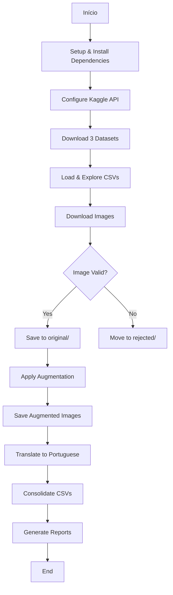

# Nutrition Label OCR - Data Collection Notebook Design

**Projeto:** Sistema de OCR para Extração de Informações Nutricionais  
**Fase:** 1 - Coleta e Preparação de Dados  
**Data:** 2026-04-06  
**Tipo:** Projeto Pessoal (Aprendizado/Portfólio)

## Objetivo

Desenvolver um Jupyter Notebook em Python para coletar, organizar e preparar um dataset de imagens de rótulos nutricionais a partir de datasets Kaggle, aplicando data augmentation para aumentar a quantidade e variedade dos dados de treinamento.

## Contexto

Este notebook é a primeira fase de um sistema completo de OCR que eventualmente incluirá:
- **Fase 1 (este design):** Notebook de coleta de dados
- **Fase 2 (futura):** API em Node.js/Python para processar imagens
- **Fase 3 (futura):** Frontend Angular para interface de usuário

O sistema final deve ser capaz de extrair informações nutricionais de rótulos em múltiplos idiomas.

## Escopo da Fase 1

### In Scope
- Download de 3 datasets Kaggle via API
- Análise exploratória dos dados (estatísticas, distribuição)
- Download de imagens referenciadas nos CSVs
- Data augmentation (4x o tamanho original)
- Tradução automática de nutrientes para português
- Organização em estrutura de pastas e CSVs
- Logs e relatórios de processo

### Out of Scope
- Treinamento do modelo OCR (fase 2)
- Desenvolvimento da API (fase 2)
- Interface de usuário (fase 3)
- Web scraping de fontes externas ao Kaggle
- Anotação manual de novas imagens
- Pré-processamento específico para OCR (será na fase 2)

## Abordagem Escolhida

**Híbrida - Kaggle + Data Augmentation**

Combina a base sólida dos datasets Kaggle (qualidade verificada, estrutura existente) com expansão automática via augmentation para criar um dataset robusto sem necessidade de anotação manual extensiva.

### Alternativas Consideradas

1. **Manual Download + Pandas apenas:** Rápido mas dataset limitado
2. **Web Scraping:** Flexível mas muito trabalhoso e requer anotação manual
3. **Híbrida (escolhida):** Equilíbrio entre velocidade e quantidade de dados

## Arquitetura do Notebook

### Seções Principais

```
1. Setup & Dependencies
   ├─ Instalação de bibliotecas
   ├─ Configuração do ambiente Kaggle
   └─ Imports e configurações globais

2. Kaggle Dataset Download
   ├─ Download via Kaggle API
   ├─ Extração dos arquivos
   └─ Verificação de integridade

3. Data Exploration
   ├─ Carregamento dos CSVs
   ├─ Estatísticas descritivas
   ├─ Distribuição de idiomas
   ├─ Completude de informações nutricionais
   └─ Visualizações (opcional)

4. Image Download
   ├─ Extração de URLs/paths das imagens
   ├─ Download paralelo com progress bar
   ├─ Validação de integridade (Pillow)
   └─ Registro de falhas

5. Data Augmentation
   ├─ Seleção aleatória de técnicas
   ├─ Aplicação de transformações
   ├─ Salvamento de imagens augmentadas
   └─ Atualização de metadados

6. Dataset Organization
   ├─ Tradução automática para português
   ├─ Consolidação de CSVs
   ├─ Organização de estrutura final
   └─ Geração de relatórios
```

## Estrutura de Dados

### Datasets de Entrada

**Fontes Kaggle:**
1. `mariogemoll/nutrition-facts`
2. `shensivam/nutritional-facts-from-food-label`
3. `gheysar4real/iranian-nutritional-fact-label`

### Estrutura de Output

```
leitor-ocr/
├── data/
│   ├── raw/
│   │   ├── mario_gemoll_nutrition_facts.csv
│   │   ├── shensivam_nutritional_facts.csv
│   │   └── iranian_nutritional_facts.csv
│   ├── processed/
│   │   ├── consolidated_dataset.csv
│   │   └── augmentation_log.csv
│   └── images/
│       ├── original/
│       │   ├── dataset1_001.jpg
│       │   ├── dataset1_002.jpg
│       │   └── ...
│       ├── augmented/
│       │   ├── dataset1_001_rot15.jpg
│       │   ├── dataset1_001_bright.jpg
│       │   └── ...
│       └── rejected/
│           └── (imagens corrompidas ou inválidas)
```

### Schema do CSV Consolidado

| Coluna | Tipo | Descrição |
|--------|------|-----------|
| `image_id` | string | ID único da imagem |
| `source_dataset` | string | Qual dos 3 datasets (mario/shensivam/iranian) |
| `image_path` | string | Caminho relativo para a imagem |
| `is_augmented` | boolean | Se é imagem original ou augmentada |
| `augmentation_type` | string | Técnica aplicada (null se original) |
| `language` | string | Idioma do rótulo (en, fa, pt, etc.) |
| `nutrients_original` | JSON | Informações nutricionais no idioma original |
| `nutrients_pt` | JSON | Informações traduzidas para português |
| `calories` | float | Calorias (valor numérico) |
| `protein_g` | float | Proteínas em gramas |
| `carbohydrates_g` | float | Carboidratos em gramas |
| `total_fat_g` | float | Gorduras totais em gramas |
| `... (outros nutrientes)` | float | Demais nutrientes extraídos |

**Princípio:** Extrair TUDO que estiver visível no rótulo, sem filtro de nutrientes específicos.

## Data Augmentation Strategy

### Técnicas de Transformação

| Técnica | Parâmetros | Objetivo |
|---------|------------|----------|
| **Rotação** | ±5°, ±10°, ±15° | Simular fotos tortas |
| **Brilho/Contraste** | ±20% | Simular diferentes condições de iluminação |
| **Gaussian Blur** | sigma=0.5-1.0 | Simular fotos levemente desfocadas |
| **Crop + Resize** | 90-110% do original | Simular diferentes distâncias da câmera |

### Quantidade e Seleção

- **Por imagem original:** 3-5 variações
- **Seleção:** Aleatória de combinações (não todas as técnicas em todas as imagens)
- **Target:** ~4x o tamanho do dataset original
- **Preservação:** Mesmas anotações das imagens originais com flag `is_augmented=True`

### Justificativa

Data augmentation permite:
- Dataset maior sem anotação manual
- Modelo mais robusto a variações reais (iluminação, ângulo, foco)
- Treinamento mais eficaz com dados limitados

## Tratamento de Múltiplos Idiomas

### Detecção de Idioma

1. **Primária:** Coluna `language` nos CSVs (se disponível)
2. **Secundária:** Heurística baseada no nome do dataset
   - iranian → Farsi/Persa
   - Demais → Inglês (default)
3. **Adicionar:** Coluna `detected_language` no CSV consolidado

### Tradução Automática

- **Biblioteca:** `googletrans==4.0.0rc1`
- **Idioma alvo:** Português (pt)
- **Processo:**
  1. Detectar idioma original
  2. Se não for português, traduzir nomes de nutrientes
  3. Preservar valores numéricos (não traduzir)
  4. Salvar ambas versões: `nutrients_original` e `nutrients_pt`
  
- **Error handling:** Se API falhar, marcar como `translation_pending`, não bloquear

### Distribuição Esperada

- **Inglês:** Maioria
- **Farsi/Persa:** Dataset iraniano
- **Outros:** Conforme presente nos datasets

## Error Handling & Validação

### Tratamento de Erros

| Erro | Ação |
|------|------|
| Download de imagem falhou | Registrar em `failed_downloads.log`, continuar |
| Imagem corrompida | Detectar com Pillow, mover para `rejected/` |
| CSV malformado | Logar linha problemática, pular |
| API de tradução indisponível | Marcar `translation_pending`, continuar |

### Validações de Qualidade

**Imagens:**
- ✓ Resolução mínima: 200x200 pixels
- ✓ Formato válido: JPG, PNG
- ✓ Arquivo não corrompido (abre com Pillow)

**Dados:**
- ✓ CSV tem pelo menos UMA informação nutricional válida
- ✓ Valores numéricos são razoáveis (não negativos, etc.)

**Critério de aceitação:** Foco em QUANTIDADE. Aceitar imagens parcialmente anotadas.

### Logs e Relatórios

**Sumário final incluirá:**
- Total de imagens baixadas
- Total de imagens rejeitadas (com razões)
- Total de imagens augmentadas
- Taxa de sucesso por dataset
- Distribuição de idiomas
- Top 10 nutrientes mais comuns
- Estatísticas de completude (% imagens com calorias, proteínas, etc.)

## Ferramentas & Tecnologias

### Bibliotecas Python

```python
# Core
python >= 3.10

# Data manipulation
pandas >= 2.0.0
numpy >= 1.24.0

# Kaggle
kaggle >= 1.5.16

# Image processing
Pillow >= 10.0.0
opencv-python >= 4.8.0

# Augmentation
imgaug >= 0.4.0

# HTTP & Progress
requests >= 2.31.0
tqdm >= 4.66.0

# Translation
googletrans == 4.0.0rc1
```

### Ambiente de Execução

- **Formato:** Jupyter Notebook (.ipynb)
- **Configuração Kaggle:** `~/.kaggle/kaggle.json` com API token
- **Recursos:** ~2-4GB RAM, ~10-20GB disco (dependendo do tamanho dos datasets)

## Estimativas

### Tempo de Execução

| Fase | Estimativa |
|------|------------|
| Download datasets Kaggle | 5-10 min |
| Download de imagens | 30-60 min |
| Data augmentation | 10-20 min |
| Tradução automática | 5-10 min |
| Consolidação e relatórios | 5 min |
| **Total** | **~1-2 horas** |

*Estimativas assumem internet razoável e ~1000-3000 imagens originais*

### Tamanho do Dataset Final

- **Imagens originais:** ~1000-3000 (depende dos datasets Kaggle)
- **Imagens augmentadas:** ~4000-12000 (4x original)
- **Total:** ~5000-15000 imagens
- **Espaço em disco:** ~5-15GB

## Fluxo de Execução



## Critérios de Sucesso

### Métricas de Sucesso

1. ✅ **Dataset baixado:** Todos os 3 datasets Kaggle obtidos com sucesso
2. ✅ **Imagens válidas:** >80% das imagens baixadas passam na validação
3. ✅ **Augmentation completo:** ~4x o número de imagens originais
4. ✅ **Tradução:** >90% dos nutrientes traduzidos com sucesso
5. ✅ **Estrutura organizada:** CSVs e pastas seguem o schema definido
6. ✅ **Documentação:** Relatório final gerado com estatísticas

### Critérios de Qualidade

- Código bem documentado (docstrings, markdown cells explicativas)
- Progress bars para operações longas (download, augmentation)
- Cells executáveis sequencialmente sem erros
- Reprodutível (requirements.txt + instruções claras)

## Riscos e Mitigações

| Risco | Impacto | Probabilidade | Mitigação |
|-------|---------|---------------|-----------|
| Datasets Kaggle removidos/inacessíveis | Alto | Baixo | Backup local após download |
| API de tradução com rate limit | Médio | Médio | Retry logic + delay entre requests |
| Imagens corrompidas em massa | Médio | Baixo | Validação robusta + rejected folder |
| Augmentation gerando imagens irreais | Baixo | Médio | Parâmetros conservadores, revisão visual |
| Memória insuficiente | Médio | Baixo | Processar em batches |

## Próximos Passos (Após esta Fase)

1. **Fase 2 - API Development:**
   - Treinar modelo OCR (Tesseract ou modelo neural)
   - Desenvolver API REST em Node.js/Python
   - Endpoint para upload e processamento de imagens
   
2. **Fase 3 - Frontend:**
   - Interface Angular para upload
   - Visualização de resultados extraídos
   - Integração com API

## Decisões Técnicas

### Por que Jupyter Notebook?

- Exploração interativa de dados
- Facilita debugging e iteração
- Boa para documentação inline
- Padrão para projetos de ML/Data Science

### Por que imgaug?

- Biblioteca madura e estável
- API simples e intuitiva
- Suporte a múltiplas transformações
- Boa documentação

### Por que googletrans?

- Gratuito e sem necessidade de API key
- Suporta múltiplos idiomas
- Adequado para volume moderado de traduções
- Fallback: deep-translator se necessário

## Considerações Finais

Este design foca em **velocidade de implementação** e **qualidade suficiente** para um projeto de portfólio. A abordagem híbrida permite criar um dataset robusto rapidamente, priorizando quantidade sobre perfeição, o que é adequado para aprendizado e iteração rápida nas fases subsequentes (API e frontend).

O sistema é extensível: se no futuro for necessário mais dados, pode-se adicionar web scraping ou anotação manual incremental sem redesenhar a estrutura.
